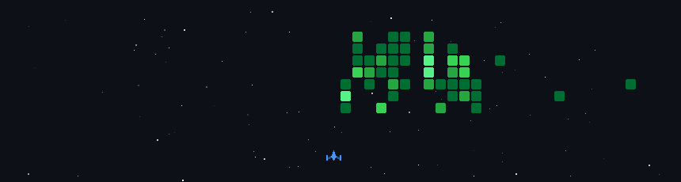

  

  

## 📌 About Me
- I’m Dipram — a 2nd year IT student who loves turning ideas into real, interactive things on the internet.
- I enjoy building stuff that doesn’t just work, but actually feels alive.
- I come from a design-first background (Figma, Webflow), so I naturally care about how things look and feel, not just how they function. Now I’m bridging that with code to become someone who can build complete experiences from scratch.
- I’m still early in the journey — but I move fast, experiment a lot, and I’m always building something.

## 🧠 My Focus Areas
- Frontend Development
- UI/UX + Interactive Design
- Hackathon Building
- Freelance Web Projects
- Creative Development
- Open Source Contribution

## 📊 GitHub Stats & Trophies

  
  

  

  

## 🛠️ Languages & Tools

> ## Programming Languages

  &nbsp;&nbsp;&nbsp;&nbsp;&nbsp;&nbsp;&nbsp;&nbsp;&nbsp;&nbsp;&nbsp;&nbsp;&nbsp;&nbsp;&nbsp;&nbsp;

> ## Frontend

  &nbsp;&nbsp;&nbsp;&nbsp;&nbsp;&nbsp;&nbsp;&nbsp;&nbsp;&nbsp;&nbsp;&nbsp;&nbsp;&nbsp;&nbsp;&nbsp;

> ## Backend

  &nbsp;&nbsp;&nbsp;&nbsp;

> ## Database

  &nbsp;&nbsp;&nbsp;&nbsp;&nbsp;&nbsp;&nbsp;&nbsp;&nbsp;&nbsp;&nbsp;&nbsp;

> ## Tools

  &nbsp;&nbsp;&nbsp;&nbsp;&nbsp;&nbsp;&nbsp;&nbsp;&nbsp;&nbsp;&nbsp;&nbsp;&nbsp;&nbsp;&nbsp;&nbsp;

  

## 🔗 Connect with Me

  &nbsp;&nbsp;&nbsp;&nbsp;&nbsp;&nbsp;&nbsp;&nbsp;&nbsp;&nbsp;&nbsp;&nbsp;

  

